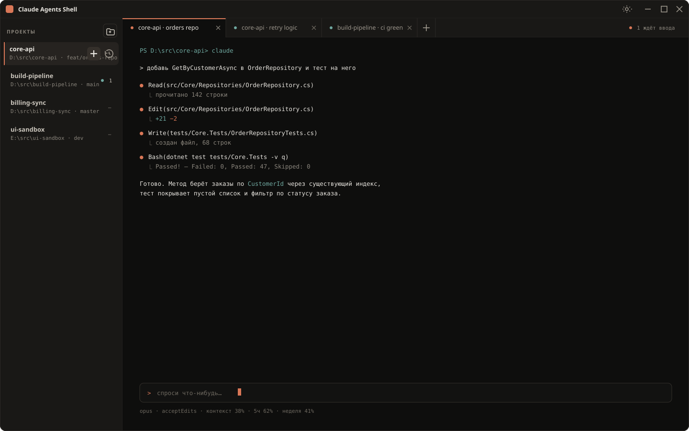

# Claude Agents Shell

Одно окно, в котором одновременно живут несколько сессий
[Claude Code](https://claude.com/claude-code) — по разным проектам, каждая в своей вкладке.

Внутри вкладки работает настоящий терминал с настоящим TUI Claude Code. Оболочка **не** рисует
свой чат, **не** разбирает вывод агента и **не** подменяет собой CLI: она занимается только тем,
чего у CLI нет, — списком проектов, вкладками и видимым состоянием каждой сессии.



<sub>Макет из `docs/mockup.html`. Живой интерфейс местами уже разошёлся с ним.</sub>

## Зачем это нужно

Работа с агентом редко бывает одиночной: пока он собирает проект, хочется идти в соседний
и запустить второго. Обычно это кончается россыпью окон терминала, в которой непонятно,
кто из них чего ждёт.

- **Несколько сессий в одном окне.** Слева список проектов, справа вкладки. Пять сессий
  по трём проектам — это по-прежнему одно окно на панели задач.
- **Новая сессия — один клик** по кнопке «+» на строке проекта. Без диалогов, без выбора
  каталога: рабочий каталог, оболочка и аргументы уже прописаны у проекта.
- **Видно, кто чего ждёт.** У каждой вкладки точка состояния, а в полосе вкладок — счётчик
  «N ждёт ввода», по которому можно сразу перейти к первой такой сессии.
- **Переключение без ожидания.** Буфер вкладки никуда не девается: вернувшись, вы видите
  всю историю вывода, а не перерисованный с нуля экран.
- **Настоящий терминал.** Рамки TUI, эмодзи, кириллица, цвета, вставка многострочного текста,
  `Ctrl+C` — всё ведёт себя как в обычном терминале.

## Что уже умеет

- Список проектов: имя, путь, текущая ветка git, число открытых сессий и маркер состояния.
- Диалог проекта: путь с выбором папки, имя, оболочка, команда перед запуском,
  дополнительные аргументы `claude`; показывает, найдены ли `CLAUDE.md` и `.mcp.json`.
- Контекстное меню строки проекта: открыть папку в проводнике, настройки, убрать из списка.
- Вкладки: точка состояния, заголовок `<проект> · <короткое имя сессии>`, перетаскивание
  для смены порядка, горячие клавиши (`Ctrl+Shift+T`, `Ctrl+Shift+W`, `Ctrl+Tab`,
  `Ctrl+Shift+Tab`, `Ctrl+1..9`).
- Короткое имя вкладки берётся из первого сообщения сессии, а не придумывается.
- Упавшая сессия оставляет вкладку с кодом выхода и кнопкой «перезапустить».
- Если WebView2 Runtime не установлен — понятное сообщение со ссылкой, а не стек-трейс.

Окно истории сессий и `--resume` (этап M3) отложены, поэтому вернуться к вчерашней сессии
из интерфейса пока нельзя. Порядок вкладок между запусками тоже не сохраняется.

## Чем отличается от других способов

Главное свойство решения — минимализм: оболочка добавляет к `claude` ровно окно и вкладки
и старается не стоить ничего сверх этого.

**Против нескольких окон Windows Terminal.** Одно окно вместо россыпи, состояние каждой сессии
видно, не переключаясь на неё. Проект помнит свой каталог, оболочку и аргументы, так что запуск
не начинается с `cd`.

**Против IDE-расширений и Electron-обёрток.** Вкладка не приносит с собой процесс рендерера:
на всё окно приходится **один** экземпляр WebView2, а новая вкладка — это ещё один экземпляр
xterm.js внутри той же страницы. Оболочка не просыпается по таймеру: вывод
приходит из псевдоконсоли, изменения веток и каталогов — от `FileSystemWatcher`, состояние
сессий — от хуков Claude Code. Периодического опроса каталогов и процессов в проекте нет
принципиально.

**Против веб-интерфейсов поверх агента.** Внутри вкладки живёт настоящий процесс `claude`
со своим TUI, а не перерисованный чужим UI чат. Из этого следуют три вещи: доступны все
возможности CLI, включая те, что появились вчера; ничего не отстаёт от обновлений Claude Code,
потому что нечему отставать; оболочка не может исказить то, что показывает агент.

**Аккуратность к чужим данным.** В каталог пользовательского проекта не пишется ничего.
Файлы сессий в `~/.claude/projects` только читаются — ни правки, ни удаления. Настройки
с хуками генерируются в каталоге приложения и передаются сессии через `--settings`.

**Без интернета.** Никаких CDN: xterm.js и аддоны лежат локально и отдаются странице через
`SetVirtualHostNameToFolderMapping`.

Сравнительных замеров с альтернативами не проводилось — всё сказанное выше про устройство,
а не про цифры.

## Как это устроено

```
WPF-процесс
├── ОДИН экземпляр WebView2 на всё окно
│   └── страница с N экземплярами xterm.js (по одному на вкладку)
└── N пар процессов: pwsh → claude (каждая в своём ConPTY)
```

Три решения определяют всё остальное — и каждое видно пользователю.

**Один WebView2 на окно, а не на вкладку.** Контрол на вкладку означал бы процесс рендерера
на каждую вкладку. Здесь переключение вкладки — смена видимости контейнера на странице:
ровно одно сообщение моста и ни одной перерисовки буфера. Отсюда мгновенное переключение
и сохранённая история фоновых вкладок.

**Вывод PTY передаётся как base64 сырых байтов.** Декодировать чанки в строку на стороне C#
нельзя: чанк рвётся посреди UTF-8 последовательности. Состояние декодера держит xterm.js —
поэтому кириллица и рамки TUI не рассыпаются на границах чтений.

**Байты склеиваются в пачки** — кадр 16 мс или 64 КБ. ConPTY отдаёт чтения мелкими порциями;
без склейки на страницу уходили бы тысячи сообщений на мегабайт вывода вместо примерно сорока.
Отсюда то, что шумный `dotnet build` в трёх соседних вкладках не подвешивает набор текста
в активной.

Состояние вкладки берётся **только из хуков** Claude Code (`SessionStart`, `Stop`,
`UserPromptSubmit`, `SessionEnd` и другие), а не из разбора экрана. Не сработали хуки — вкладка
живёт без маркера состояния, и это нормальная деградация, а не ошибка.

## Состояние проекта

| Этап | Состояние |
|---|---|
| M1 — мост ConPTY ↔ WebView2 | закрыт, принят пользователем, в `main` |
| M2 — проекты и вкладки | закрыт, принят пользователем, в `main` |
| M3 — история сессий и `--resume` | отложен пользователем |
| M4 — состояние сессий по хукам | код готов, ревью и аудит пройдены, приёмка частичная |
| M5 — доводка | код готов, ревью и аудит пройдены, приёмка частичная |

Сборка без предупреждений, 609 тестов зелёные.

M4 и M5 живут в ветках `stage/m4-state` и `stage/m5-polish` (вторая содержит первую) и в `main`
не влиты: туда уходит только принятое, а визуальная приёмка обоих этапов ещё не закончена.
Клон ветки по умолчанию даёт M1 и M2. Что именно осталось проверить — в разделе «План приёмки»
файла [`docs/PROGRESS.md`](docs/PROGRESS.md); там же принятые решения, известный технический
долг и то, что выглядит багом, но им не является. Техническое задание — [`docs/TZ.md`](docs/TZ.md).

## Требования

- Windows 10 1809+ или Windows 11, x64 (ConPTY требует 1809+)
- .NET 8 SDK
- [WebView2 Runtime](https://developer.microsoft.com/microsoft-edge/webview2/) (Evergreen)
- Node.js — только чтобы разложить ассеты xterm.js локально
- `pwsh` или `powershell.exe`; `claude` в `PATH`

## Сборка и запуск

```powershell
cd web
npm install
npm run vendor      # раскладывает xterm.js и аддоны в web/vendor
cd ..

dotnet build ClaudeAgentsShell.sln
.\src\ClaudeAgentsShell.App\bin\Debug\net8.0-windows10.0.17763.0\ClaudeAgentsShell.exe
```

`web/vendor/` не хранится в репозитории, поэтому `npm run vendor` обязателен на чистом клоне —
без него страница терминалов не соберётся.

```powershell
dotnet test ClaudeAgentsShell.sln
dotnet format --verify-no-changes
```

## Структура

```
src/ClaudeAgentsShell.Domain        модели, без зависимостей вообще
src/ClaudeAgentsShell.Application   порты (интерфейсы), сценарии
src/ClaudeAgentsShell.Terminal      ConPTY, мост, протокол сообщений
src/ClaudeAgentsShell.Sessions      projects.json, история, хуки
src/ClaudeAgentsShell.App           WPF, ViewModel, DI-композиция
web/                                страница терминалов, xterm.js локально
tests/                              модульные тесты
```

Зависимости направлены внутрь: `App → Sessions/Terminal → Application → Domain`.
Обратных ссылок нет. Прикладной код работает через порты: `IPtySession`, `ITerminalBridge`,
`IProjectStore`, `ISessionHistoryReader`, `IHookListener` и остальные.
`Domain` не зависит ни от чего.

## Данные

`%APPDATA%\ClaudeAgentsShell\` — список проектов, файл настроек с хуками, журнал сбоев.
Запись `projects.json` атомарная.

В каталог пользовательского проекта приложение не пишет ничего. Файлы сессий Claude Code
в `~/.claude/projects` **только читаются**: ни удаления, ни записи. Формат `.jsonl` считается
нестабильным — сбой разбора деградирует до «имя файла и дата», но не роняет приложение.
