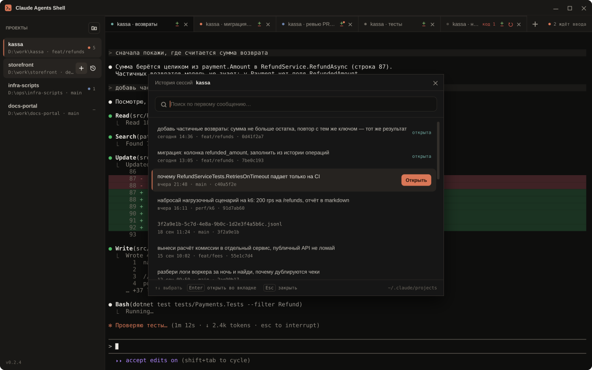
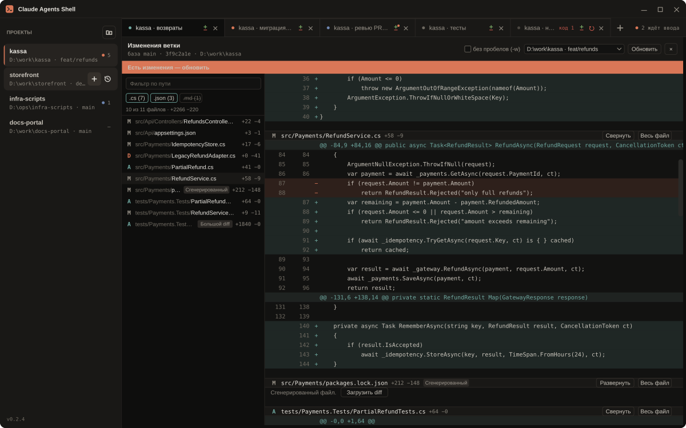

# Claude Agents Shell

**Несколько сессий [Claude Code](https://claude.com/claude-code) в одном окне — по проектам,
во вкладках, и сразу видно, какая из них ждёт вас.**

<p align="center">
  
</p>

<p align="center">
  <a href="https://github.com/k-kuzmin/claude-agents-shell/releases/latest"><b>Скачать последнюю версию для Windows</b></a>
</p>

Работа с агентом редко бывает одиночной: пока он собирает один проект, хочется запустить
второго в соседнем. Обычно это кончается россыпью окон терминала, в которой непонятно, кто
из агентов уже закончил, кто ждёт ответа, а кто ещё работает. Claude Agents Shell собирает
эти сессии в одно окно и показывает состояние каждой, не заставляя в неё переключаться.

Внутри вкладки — настоящий терминал с настоящим `claude`. Приложение не рисует свой чат и не
подменяет CLI: все возможности Claude Code, включая вышедшие вчера, работают как обычно.

## Для кого

- Вы ведёте несколько сессий Claude Code одновременно — в разных проектах или в одном.
- Вам надоело перебирать окна терминала, чтобы найти агента, который ждёт ответа.
- Вы хотите вернуться к вчерашней сессии, не вспоминая её id.
- Вы работаете на Windows.

## Что умеет

### Проекты и вкладки

Слева — список проектов: имя, путь, текущая ветка git и число открытых сессий. Кнопка «+» на
строке проекта сразу открывает новую сессию — без диалогов: каталог, оболочка и аргументы
`claude` уже прописаны у проекта. Справа — вкладки сессий выбранного проекта. Заголовок вкладки
берётся из первого сообщения сессии.

Буфер вкладки при переключении не теряется: вернувшись, вы видите весь прежний вывод. Рамки TUI,
эмодзи, кириллица, цвета, вставка многострочного текста и `Ctrl+C` ведут себя как в обычном
терминале. Шумный вывод в соседних вкладках не замедляет набор текста в активной.

Горячие клавиши: `Ctrl+Shift+T` — новая сессия, `Ctrl+Shift+W` — закрыть вкладку,
`Ctrl+Tab` / `Ctrl+Shift+Tab` — соседняя вкладка, `Ctrl+1..9` — по номеру. Порядок вкладок
меняется перетаскиванием.

### Кто чего ждёт

У каждой вкладки есть точка состояния:

- **работает** — агент занят;
- **ждёт ввода** — агент закончил или просит разрешения на действие;
- **работа в фоне** — у агента идут свои сабагенты или фоновые задачи, отвечать пока не нужно.

В полосе вкладок — счётчик «N ждёт ввода»: щелчок по нему переключает на первую такую сессию.
Маркер состояния есть и на строке проекта, так что видно, в каком проекте вас ждут.

Состояние приходит из хуков Claude Code, а не из догадок по тексту на экране.

### Вкладки восстанавливаются при запуске

Закрыли окно — при следующем запуске открытые сессии поднимаются в прежнем порядке и продолжаются
с тем же контекстом (`claude --resume`). Активные вкладка и проект тоже прежние. Сессии, из
которых вы вышли командой `/exit`, не возвращаются.

### История сессий

Кнопка с часами на строке проекта открывает список прошлых сессий: первое сообщение, дата,
ветка, короткий id. Поиск по мере ввода, стрелки, `Enter` — продолжить сессию во вкладке,
`Esc` — закрыть. Сессия, уже открытая во вкладке, помечена «открыта»: выбор переключает на неё,
а не запускает второй `claude`.

<p align="center">
  
</p>

Список обновляется сам, пока окно открыто, и не мигает, когда в соседних вкладках работают
агенты. В нём только сессии, которые вы вели в терминале: запуски через Agent SDK и `claude -p`
не показываются. Сотни сессий проекта читаются за десятки миллисекунд.

### Что поменял агент — прямо рядом с терминалом

`Ctrl+Shift+D` или кнопка на вкладке открывает изменения ветки относительно базовой: коммиты,
незакоммиченные и новые файлы. Есть «игнорировать пробелы», «обновить» и выбор рабочего дерева,
если их несколько. Крупные и сгенерированные файлы свёрнуты, чтобы большой diff не подвешивал
окно. Если агент правит файлы при открытой панели, она предлагает обновиться.

<p align="center">
  
</p>

Агент может показать diff сам: в сессию подключён инструмент `show_diff`. Попросите «покажи
изменения в этих файлах» — панель откроется рядом с его терминалом. Если это случилось в фоновой
вкладке, на её кнопке diff появится точка.

### Настройки проекта

Путь с выбором папки, отображаемое имя, оболочка (PowerShell 7, Windows PowerShell или `cmd`),
команда перед запуском `claude` и дополнительные аргументы. Диалог показывает, найдены ли в
каталоге `CLAUDE.md` и `.mcp.json`. Контекстное меню строки: открыть папку в проводнике,
настройки, убрать из списка.

Если сессия упала, вкладка остаётся с кодом выхода и кнопкой «перезапустить».

## Чем отличается

**От нескольких окон терминала.** Одно окно вместо россыпи, состояние каждой сессии видно
без переключения на неё, проект помнит свой каталог и аргументы, вчерашняя сессия — в истории.

**От веб-интерфейсов и чатов поверх агента.** Во вкладке живёт сам `claude` со своим TUI.
Нечему отставать от обновлений Claude Code, и оболочка не может исказить то, что показывает агент.

**От Electron-обёрток и IDE.** На всё окно — один встроенный браузерный движок (WebView2),
а новая вкладка — ещё один терминал на той же странице, а не ещё один процесс браузера.
Приложение не опрашивает каталоги и процессы по таймеру: оно реагирует на вывод сессий, события
файловой системы и хуки.

Сравнительных замеров с другими инструментами не проводилось — это описание устройства, а не цифры.

## Установка

1. [Скачайте](https://github.com/k-kuzmin/claude-agents-shell/releases/latest) архив
   `ClaudeAgentsShell-<версия>-win-x64.zip`, распакуйте и запустите `ClaudeAgentsShell.exe`.
   .NET ставить не нужно — сборка самодостаточная.
2. Нужны Windows 10 1809+ или Windows 11 x64 и
   [WebView2 Runtime](https://developer.microsoft.com/microsoft-edge/webview2/). В Windows 11
   он уже установлен; если его нет, приложение скажет об этом и даст ссылку.
3. **Нужен установленный Claude Code.** Приложение запускает в каждой вкладке команду `claude`,
   поэтому она должна работать в обычном окне PowerShell. Проверить: открыть PowerShell и
   выполнить `claude --version`. Если команда не найдена — установить Claude Code и открыть
   новое окно.

## Приватность и безопасность

- **В ваш проект ничего не пишется.** Настройки хуков и подключение `show_diff` генерируются в
  каталоге приложения и передаются сессии через `--settings` и `--mcp-config`. Ваши
  `.claude/settings.json` и `.mcp.json` не меняются.
- **Файлы сессий Claude Code только читаются.** В `~/.claude/projects` приложение ничего не
  удаляет и не записывает. Если формат файла изменится, история покажет имя файла и дату,
  а не упадёт.
- **Слушает только локальный адрес.** Хуки и `show_diff` приходят на `127.0.0.1` на порт,
  выбранный при запуске.
- **Терминалы не грузят ничего из интернета.** xterm.js и его дополнения лежат в приложении,
  CDN не используются.
- **Вывод агента не анализируется.** Состояние вкладки определяется только по хукам.
- Свои данные — список проектов, раскладку вкладок, настройки хуков, журналы — приложение
  хранит в `%APPDATA%\ClaudeAgentsShell\`.

## Статус и планы

Готово и выпущено: проекты и вкладки, состояние сессий по хукам, восстановление вкладок при
запуске, история сессий с продолжением, встроенный diff и `show_diff`. Что изменилось в каждой
версии — в [описаниях релизов](https://github.com/k-kuzmin/claude-agents-shell/releases).

Известные ограничения:

- Команда `!` в Claude Code не порождает хуков, поэтому ответ на неё без вызова инструментов
  не покажет «работает».
- Дополнительные аргументы проекта не передаются в восстановленную или продолженную сессию
  (`--resume`).

Не планируется:

- собственный чат поверх Agent SDK и разбор вывода агента;
- встроенный редактор или git-клиент — панель diff только показывает изменения;
- управление настройками Claude Code (модель, права, MCP) из интерфейса — это делается в самой сессии;
- версии для macOS, Linux, веба и мобильных устройств.

Вопросы и ошибки — в [issues](https://github.com/k-kuzmin/claude-agents-shell/issues).

---

## Для разработчиков

WPF-приложение на .NET 8. Каждая вкладка — пара процессов «оболочка → `claude`» в своей
псевдоконсоли (ConPTY); все терминалы — экземпляры xterm.js на одной странице единственного
WebView2. Вывод PTY идёт на страницу как base64 сырых байтов пачками по кадру 16 мс или 64 КБ,
чтобы UTF-8 не рвался на границах чтений; состояние вкладок — только из хуков через локальный
HTTP-приёмник.

```
WPF-процесс
├── ОДИН WebView2 на всё окно
│   └── страница с N экземплярами xterm.js (по одному на вкладку)
└── N пар процессов: pwsh → claude (каждая в своём ConPTY)
```

Зависимости направлены внутрь, прикладной код работает через порты (`IPtySession`,
`ITerminalBridge`, `IProjectStore`, `ISessionHistoryReader`, `IHookListener` и другие):

```
src/ClaudeAgentsShell.Domain        модели, без зависимостей
src/ClaudeAgentsShell.Application   порты (интерфейсы), сценарии
src/ClaudeAgentsShell.Terminal      ConPTY, мост, протокол сообщений
src/ClaudeAgentsShell.Sessions      projects.json, раскладка, история, хуки, git, MCP
src/ClaudeAgentsShell.App           WPF, ViewModel, DI-композиция
web/                                страница терминалов и diff, xterm.js локально
tests/                              модульные тесты
```

`App → Sessions/Terminal → Application → Domain`, обратных ссылок нет.

### Сборка и запуск

Нужны .NET 8 SDK и Node.js (только чтобы разложить ассеты xterm.js).

```powershell
cd web
npm install
npm run vendor      # раскладывает xterm.js и аддоны в web/vendor
cd ..

dotnet build ClaudeAgentsShell.sln
.\src\ClaudeAgentsShell.App\bin\Debug\net8.0-windows10.0.17763.0\ClaudeAgentsShell.exe
```

`web/vendor/` не хранится в репозитории: без `npm run vendor` на чистом клоне вместо терминала
будет пустое окно.

```powershell
dotnet test ClaudeAgentsShell.sln
dotnet format --verify-no-changes
```

Предупреждения компилятора — ошибки; сборка без предупреждений, 1092 теста.
